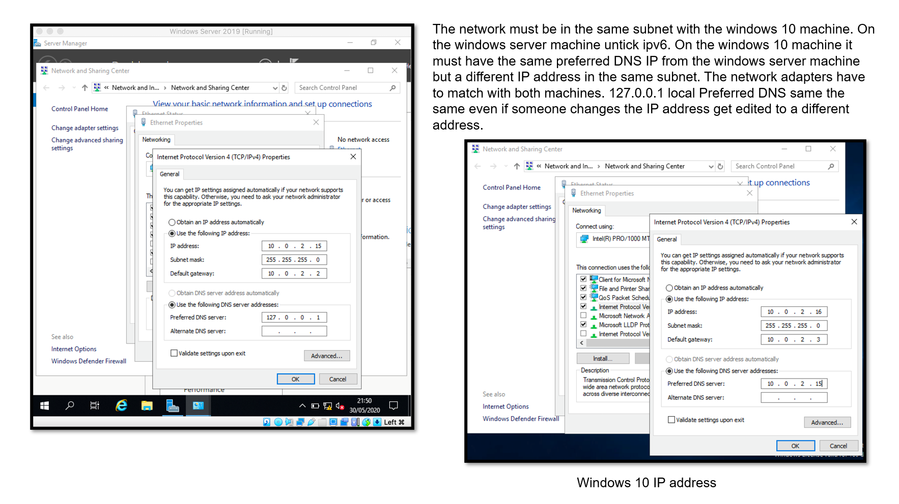
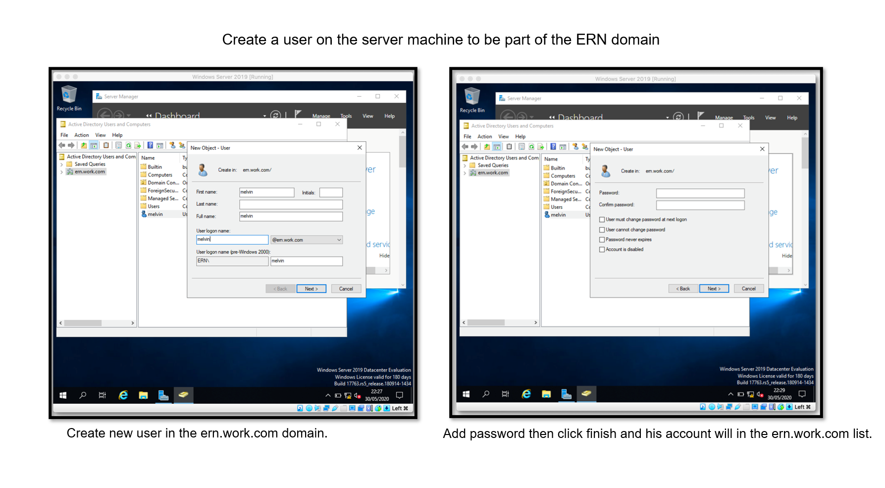
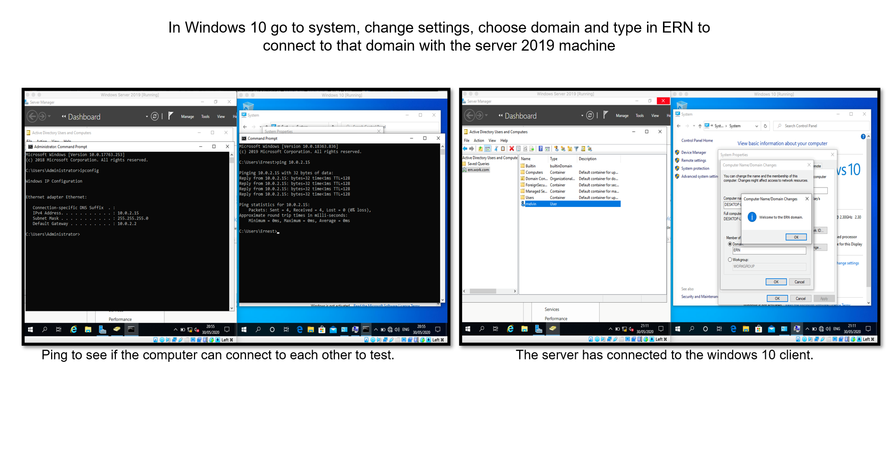
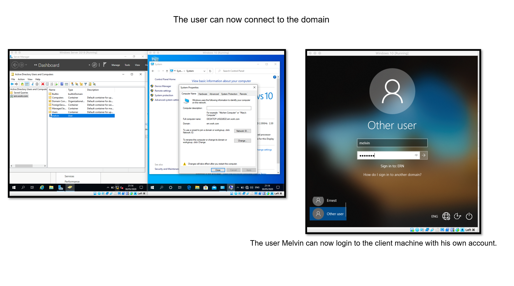

# WindowsServer-2019-Lab
## Windows Server 2019 Lab
 
### Lab:
<li>Configured the network so the server and client machines can connect. 
<li>Created a user and added a password for that user, on the server machine to be part of the domain
<li> Connected Windows 10 to Windows Server 2019

### Software used:
Virtual Box: to run Windows Server 2019 and Windows 10

 

 
 

 

