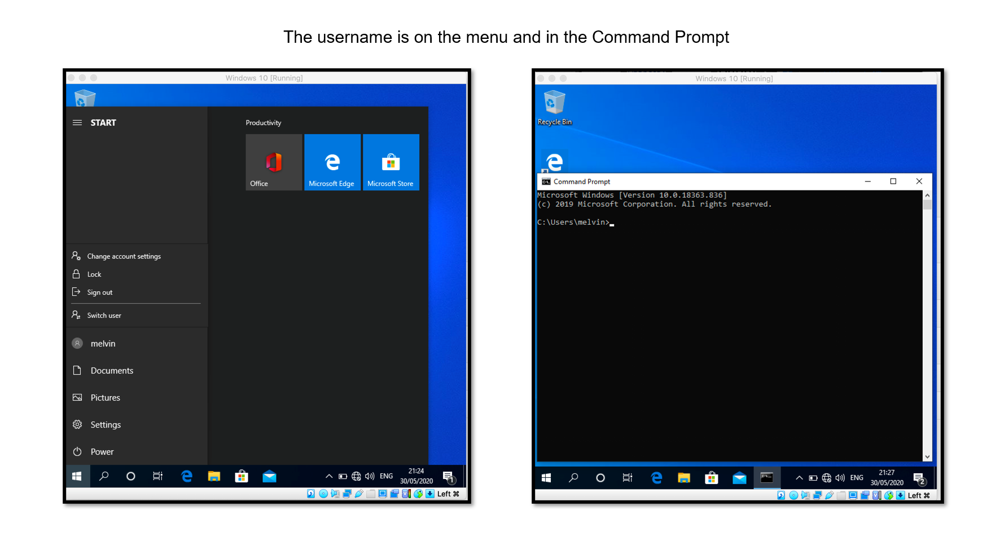

# WindowsServer-2019-Lab
## Windows Server 2019 Lab
 
### Lab:
<li>Configured the network so the server and client machines can connect. 
<li>Created a user and added a password for that user, on the server machine to be part of the domain
<li> Connected Windows 10 to Windows Server 2019

### Software used:
Virtual Box: to run Windows Server 2019 and Windows 10

### Lab pdf:
For the full pdf version of this lab click on the link below, when viewing keep pressing more pages button or if the more pages button disappears press the git hub logo that is loading. 

[Your Link Here](https://github.com/EA-IT2/WindowsServer-2019-Lab/blob/main/IT%20Support%20lab%20Windows%20server%202019.pdf)

 

 
 

 

